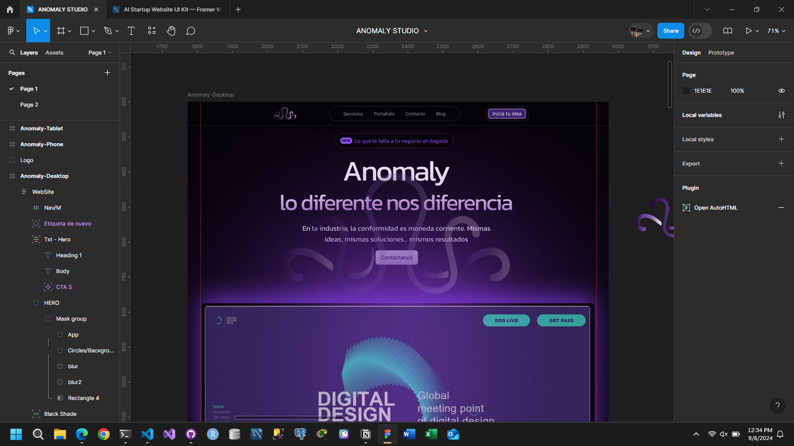

# Anomaly pagina web - Leer Readme

Diseño de la pagina web basado en Figma: <https://www.figma.com/design/1SI5NLZGIYTWLD38G4tAVk/ANOMALY-STUDIO?node-id=0-1&t=ehbIUZENUNN8MoKh-1>

Pagina hecha en React, TypeScript y NodeJS



## Importante para el proyecto

1. Instalar PNPM con PowerShell en Windows:

```terminal
    Invoke-WebRequest https://get.pnpm.io/install.ps1 -UseBasicParsing | Invoke-Expression
```

1. Instalar GitHub Desktop:

[link](https://desktop.github.com/download/)

## Pasos para editar y contribuir con la pagina

- Primero descarga el Codigo de la rama dev:

```terminal
    git clone https://github.com/YoAlejoDev/AnomalyWebSite.git
```

- Luego instala las dependencias:

```terminal
    pnpm init
    pnpm install
    pnpm install -D tailwindcss
    npx tailwindcss init  
```

- En la carpeta del server

```terminal
    pnpm init
    pnpm install -D nodemon
```

Diseño y Codigo por:

- Alejandro Hurtado: [https://github.com/YoAlejoDev](https://github.com/YoAlejoDev)
- Juan Diego Calle: [https://github.com/jdicans](https://github.com/jdicans)

© Todos los derechos reservados para Anomaly.
